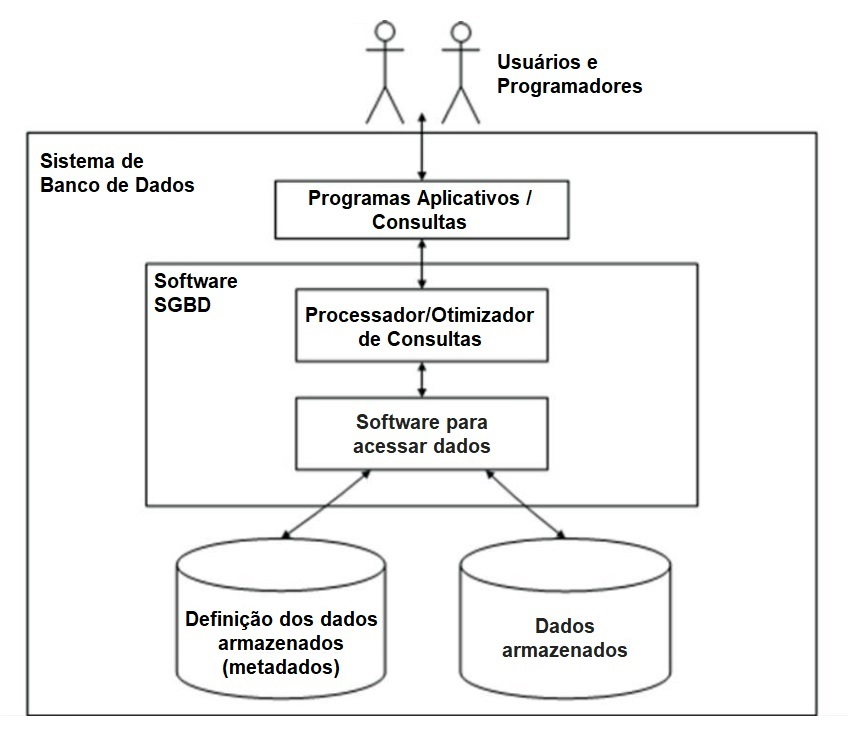
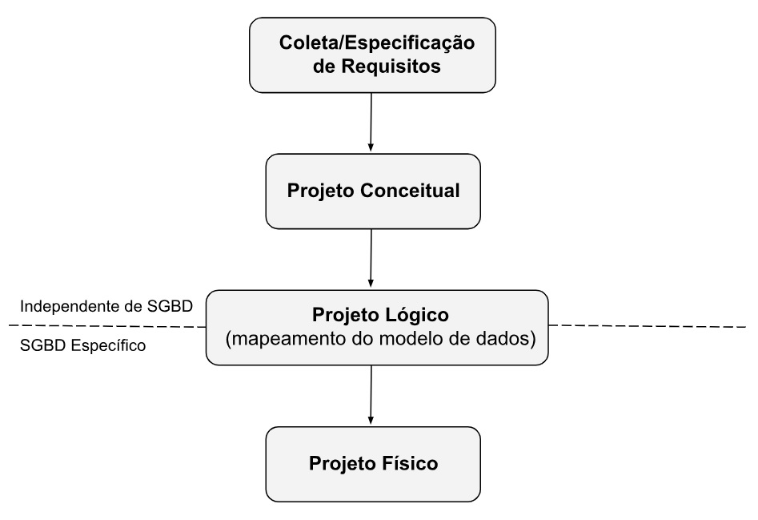
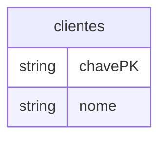
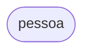
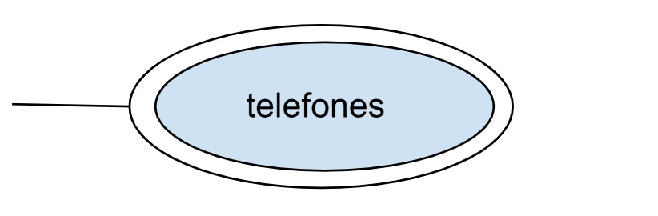
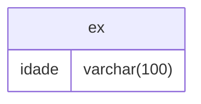
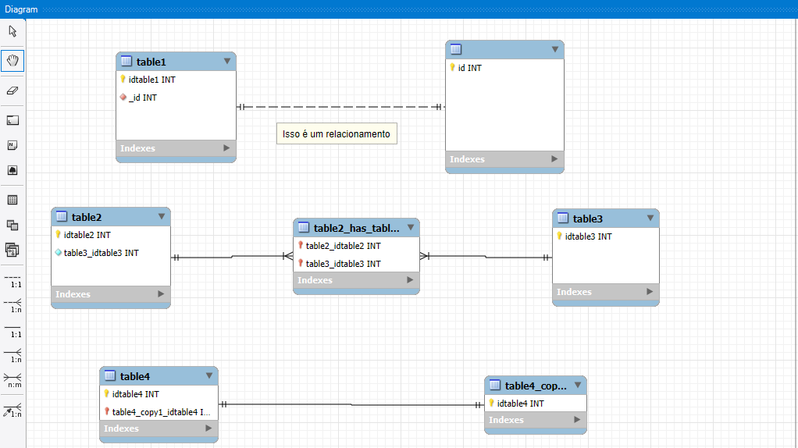

#obs:

#aula:

sistema de gerenciadores de banco de dados

Modelagem de dados

[...] Ela facilita a comunicação
 entre desenvolvedores, projetistas e
 usuários finais, resultando em sistemas
 de banco de dados bem projetados e capazes
  de lidar com os desafios
 do mundo real de maneira eficaz [...]

 - 1 modelo conceitual

 É a primeira etapa da modelagem de dados,
 aqui vamos definir
 as entidades e seus atributos e
 o relacionamento delas
- modelo mer ou er 

 2 - modelo logico
 - é um jeito de traduzir conceitos abstratos em estruturas mais próximas do que será implementado em um SGBD.
 - colocamos os
 Nessa fase, as entidades se transformam em tabelas, os atributos em colunas e os relacionamentos em chaves primárias e estrangeiras

3 - modelo fisico
Nessa fase colocamos os tipos de dados de cada atributo:

- tipos de dados para cada coluna
- criação de índices para melhorar
- o desempenho de consultas

>Assim como um arquiteto começa desenhando uma planta para visualizar a estrutura geral de um edifício antes de se preocupar com detalhes específicos de construção, um designer de banco de dados começa com o modelo conceitual para obter uma visão geral dos dados e suas relações.

# Entidades

As entidades são objetos o mundo real, são qualquer coisa que faça sentido para o contexto em que vamos criala
- são representados por [] retãngulos 

- [clientes]

# Atributos

- Nos podemos ter atributos simples(que não podem ser divididos), ou compostos que são formados por subatributos, como endereço[possui rua, cidade, e estado]
- são representados por um elipse

Pode existir atributos multivalorados, tem multiplos valores para uma unica instancia de uma entidade

Os atributos derivados, eles são valores calculados a partir de outros atributos. Eles não são armazenados fisicamente no banco de dados, mas podem ser calculados quando necessario

por exemplo:

- a idade pode ser calculada a partir da data de nascimento

# Relacionamentos

Os relacionamentos entre entidades representam suas suas associações
Nos temos as cardialidades, sendo:
- cardialidade 1:1 (um pra um):
- cardialidade N:1 (muitos para um)
- cardialiade N:N (muitos para muitos)

## Autorelacionamento
o autorelacionamento ocorre quando uma entidade se relaciona instancias da mesma entidade

- util para representar um autorrelacimento, como: supervisão
Um relacionamento pode ser "zero" ou "um" no relacionamento(opcional ou obrigatoria). O maximo pode ser "um" ou "n"

# Entidade fraca
é um entidade que não existe sozinha ela depende de outra para existir
ela tem um duplo retangulo

> entidade tipo, é uma entidade que existe independende de suas ligações

# Modelo ER estendido´
É um modelo ER +, é usado para modelar estruturas de dados em banco de dados mais abrangente
Ele introduz:
- herança
- generalização/especialização
- Agregação

# Entidade generica 

É como vamos fazer um objeto em uma linguagem com POO. Criamos uma entidade generica como "cliente" , cliente também é uma pessoa, e uma pessoa como no texto, pode ser fisica ou juridica